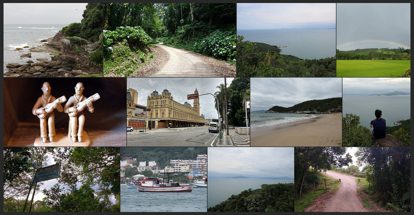

## jQuery.photostream

jQuery plugin to embed Flickr Photostream on your site.



## Usage

The basics:

```js
$('#flickr').photostream({
    api_key: '<your key>',
    user_id: '<your id>'
});
```

### Options

| Option | Description |
|:------:|:-----------:|
| api_key | Flickr API key. |
| user_id | Flickr user ID. |
| image_size | Size suffix `[sqtmnzcbnko]`. Default is `m` (small, 240 on longest side). Read more [here](https://www.flickr.com/services/api/misc.urls.html). |
| image_count | Max image count to show. Default is 10. |
| target | `<a>` target. Default is `_blank`. |

### Events

| Event | Description |
|:------:|:-----------:|
| ps.complete | Fired when photostream is loaded. |
| ps.error | Fired when something goes wrong. For example, wrong API key. |

### How to create the justified gallery?

By default jQuery.photostream doesn't do nothing with images. If you want to create a cool gallery you can use [Justified Gallery](http://miromannino.github.io/Justified-Gallery/).

Here is an example:

```js
$('#flickr').on('ps.complete', function () {
    $(this).justifiedGallery({
        rowHeight: 120,
        lastRow: 'justify',
        captions: true,
        randomize: true,
        border: 4,
    });
});
```
